|image0|

|image1|

|image2|\ |image3|

**CONTROL DE VERSIONES / MODIFICACIONES**

+---------------+--------------------------------------+--------------+------------------+
| **Versión**   | **Descripción de la Modificación**   | **Fecha**    | **Visado por**   |
+---------------+--------------------------------------+--------------+------------------+
| 1.0           | Creación del Documento               | 01-09-2015   |                  |
+---------------+--------------------------------------+--------------+------------------+
|               |                                      |              |                  |
+---------------+--------------------------------------+--------------+------------------+
|               |                                      |              |                  |
+---------------+--------------------------------------+--------------+------------------+

**ÍNDICE**

1. Introducción 6

2 Contribuciones 7

3 Instalacion 8

3.1 *Proyecto Conecta* 8

3.2 *Modulos necesarios* 8

3.3 *Modulos opcionales* 9

4 Compañia 10

4.1 *Pagina Conecta* 10

4.1.1 Cuentas 10

5 Empleados 11

5.1 *Informacion publica* 11

5.2 *Informacion Personal* 11

5.3 *Configuracion HR* 11

5.4 *Datos fiscales* 11

5.5 *Familiares* 12

5.6 *Titulacion* 13

5.6.1 Academicos 13

5.6.2 Idiomas 13

5.7 *PRL (Prevencion Riesgos Laborables)* 13

5.7.1 Epi´s 13

5.7.2 Vestuario 13

5.7.3 Formacion 13

6 Contratos 14

6.1 *Cabecera del contrato* 14

6.2 *Pagina Informacion* 14

6.3 *Pagina General* 14

6.3.1 Pagina Obra/Servicio 15

6.3.2 Pagina Circunstancias 15

6.3.3 Pagina Interinidad 15

6.3.4 Clausula adicional al contrato 15

6.3.5 Anexo horas complementarias tiempo parcial 15

6.4 *Permiso de trabajo* 15

6.5 *Mensajes AFI* 15

6.6 *Mensajes FDI* 17

6.7 *Contrat@* 18

7 Convenios 19

Este campo es utilizado en la generación de los modelos TC2 y el mensaje
de cotización para el sistema RED. 19

7.1 *Categorias* 19

7.1.1 CNO-2011 (Codigo nacional de ocupaciones) 19

7.1.2 Grupo de cotización 19

7.1.3 Modificador grupo cotizacion 19

8 PRL (Prevencion Riesgos Laborables) 20

9 Nomina 21

10 Errores comunes 22

10.1 *Error de Plantilla Website* 22

10.2 WKHTMLTOPDF 22

Introducción
============

**Proyecto Conecta**, es una apuesta personal para dotar a la
localización española de minimo necesario para gestionar los Recursos
Humanos con Odoo e intentando que sea lo menos intrusivo posible con los
modulos existentes o nuevos desarrollos.

Conseguir que desde incorporación de un nuevo empleado en el sistema,
termine con la firma del contrato, superado todos los tramites previos.

En pricipio serán implementados los contratos mas básicos para poder ir
aumentando tanto en modelos con en opcines de los contratos existentes,
los contratos soportados inicialmente son 100, 200, 401, 402, 410, 501,
502, 510, prorrogas y transformaciones 189 y 289.

En el siguiente manual se indicaran los pasos y procesos a seguir, este
manual no pretende ser una guía de odoo (de momento), solo se indicaran
los campos necearios y los pasos a seguir, aun siendo muy cosciente de
que nuestra legislación en materia laboral es bastante complicada, se
intentara hacer lo mas genérico y configurable posible.

Dado que en mi actual puesto de trabajo mas del 90%, de la contratación
se basa en los modelos indicados, espero que poco a poco ir incorporando
otros con vuestro apoyo.

Contribuciones
==============

El proyecto esta abierto a toda persona que desee colaborar, bien sea
aportando ideas, mejoras en el código (que no esta nada pulido es feo,
pero ya se mejorara) o sugerencias.

Instalacion
===========

Para el correcto funcionamiento serán precisos diferentes modulos libres
aportados por la comunidad o mantenidos por
`*OCA* <https://odoo-community.org/>`__.

*Proyecto Conecta*
------------------

El proyecto conecta actualmente se compone de los siguientes
modulos:

-  **hr\_family**: Familiares a empleados

-  **hr\_school**: Titulacion academica e Idiomas

-  **hr\_employee**: Adaptacion/Creacion de nuevos campos del empleado

-  **hr\_company**: Datos de la empresa

-  **hr\_convenio**: Convenios coletivos

-  **hr\_employee\_fiscal**: Datos fiscales

-  **hr\_contract\_es**: Adaptacion/Creacion de nuevos campos del
   contrato

-  **hr\_contract\_type**: Adaptacion/Creacion de nuevos campos tipos de
   contratos

-  **hr\_sepe**: Comunicaciones con Contrat@

-  **hr\_red\_afi**: Comunicaciones AFI con Sistema RED

-  **hr\_red\_fdi**: Comunicaciones FDI con Sistema RED

-  **hr\_delta**: Comunicaciones con Sistema Delt@

*Modulos necesarios*
--------------------

-  **`*l10n \_es \ _toponyms* <https://github.com/OCA/l10n-spain>`__ v8 (con algún cambio en el asistente de importación funciona correctamente en la v9)**

-  **`*base_location* <https://github.com/OCA/partner-contact/tree/9.0/base_location>`__:**

-  **`*base_location_geonames_import* <https://github.com/OCA/partner-contact/tree/9.0/base_location_geonames_import>`__:**

-  **`*Base_iso3116* <https://github.com/OCA/community-data-files/tree/8.0/base_iso3166>`__: v8 (funciona correctamente en V9)**

    Se deberá de introducir los códigos de provincia. Ej. Jaen 23001 a 23009 (23050)

    |image10|

-  **`*report_xml* <https://github.com/OCA/reporting-engine/tree/8.0/report_xml>`__: v8 (funciona correctamente en V9)**

-  ***`Web\_timepicker <https://github.com/OCA/web/tree/9.0/web_widget_timepicker>`__\ \_widget***

*Modulos opcionales*
--------------------

La mayoría de los modulos propuestos están mantenidos por OCA:

-  **`*oerp _no_phoning_home* <https://github.com/bizzappdev/odoo_apps/tree/9.0/oerp_no_phoning_home>`__:**
   
-  **`*web_environment_ribbon* <https://github.com/OCA/web/tree/9.0/web_environment_ribbon>`__:**
   
-  **`*web_searchbar_full_width* <https://github.com/OCA/web/tree/9.0/web_searchbar_full_width>`__:**
   
-  **`*web_favicon* <https://github.com/OCA/web/tree/9.0/web_favicon>`__:**

-  `***hr_employee_documents*** <https://github.com/onaoura/odoo-apps/tree/9.0/hr_employee_documents>`__:
   
|image11|\ Compañia 
====================

*Pagina Conecta*
----------------

-  **Tipo Empresario:**

-  **Tipo Iden. Empresario:**

-  **Identificacion:** Numero de identificación del empresario C.I.F.

-  **Codigo Cuenta Cotizacion:** Asignado por la Seguridad Social.

-  **Regimen:** Regimen Segurida Social.

-  **Mutua Acc.:** Mutua de accidentes laborales.

-  **CNAE:** Cdigo Nacional de Actividades Economicas.

-  **Oficina de empleo:** Provincia donde serán presentados los
   contratos.

-  **Representante legal:** Indicar la persona responsable en la firma
   de la contratación.

Cuentas
~~~~~~~

Empleados
=========

*Informacion publica*
---------------------

*Informacion Personal*
----------------------

-  **Nacionalidad**: Este campo será usado en todas las comunicaciones
   con la administracion

-  **Nº Seguridad Social**: Indicar numero de documento Seguridad Social

-  **Tipo de identificación**: Indicar tipo documento de identidad

-  DNI/NIF

-  Identificador de extranjero

-  Ciudadado de la UE/EEE sin NIE

-  Ciudadano no perteneciente a UE/EE sin NIE

-  **Identificacion**: Indicar numero de documento de identidad

-  **Nº de pasaporte**: Indicar numero documento

-  **Nº Cuenta Bancaria**: Indicar numero donde se realizara el ingreso
   de la nomina

-  **Direccion particular**: Indicar dirección actual de residencia

-  **Telefonos**: Indicar fijo y/o Movil, el numero teléfono móvil si
   existe sera comunicado en el envio de ficheros de afiliación (AFI)

-  **Sexo**: Indicar sexo empleado

-  **Esdato** civil: indicar situación actual

-  Soltero

-  Casado

-  Viudo

-  Divorciado

-  **Nº de hijos**: Campo calculado según información de la ficha de
   familiares

-  **Fecha de nacimiento**: Indicar la fecha de nacimiento del empleado

-  **Lugar de nacimiento**: Indicar pais de nacimiento del empleado

-  **Edad**: Campo calculado según la fecha de nacimiento

*Configuracion HR*
------------------

-  **Compañía**: Indicar la compañía inicial donde se incorporara el
   empleado

*Datos fiscales*
----------------

Los datos ficales serán creados automáticamente para cada mes, por el
periodo que dure la de contratación del empleado. Futuro uso en nomina

*Familiares*
------------

Agrege cuantos familiales menores de 18 años y hasta 25 año si disponen
de certificado de minusvalía convivan con el empleado. Los datos
aportados serán usados para la generación del `*Modelo
145* <http://www.agenciatributaria.es/AEAT.internet/Modelos_formularios/modelo_145.shtml>`__,

-  **Tipo de miembro**: Indicar parentesco con el empleado.

-  **Apellidos y Nombre**: indicar apellidos y nombre.

-  **DNI/NIF**: Indicar numero de documento de identidad

-  **Sexo**: indicar sexo.

-  **Fecha de nacimiento**: Indicar fecha de nacimiento.

-  **Fecha de adopción**: En caso de descendientes adoptados, indicar
   fecha de adopción.

-  **Lugar de nacimiento**: Indicar lugar de nacimiento.

-  **Nacionalidad**: Indicar nacionalidad.

-  **Minusvalia**: Indicar tramo de minusvalía.

-  **Factor familiar**: Dado que el cálculo del I.R.P.F. debe considerar
   tanto a ascendientes como a decendientes y que, en ambos casos debe
   poderse distinguir entre distintas situaciones a la hora de fijar el
   factor de aplicación del mínimo familiar, aquí puede elegir la opción
   que convenga para el registro que está creando.

 
~

**Ascendientes:** Cuando dos o más contribuyentes conviven con el mismo
ascendiente, teniendo por tanto derecho a la aplicación de los mínimos
familiares correspondientes, su importe se prorrateará entre ellos por
partes iguales.

    Para ello, en este campo puede indicarse el factor de aplicación que
    corresponda por el ascendiente en cuestión. El dato es análogo al
    del campo 'Convivencia' del programa de Cálculo de Retenciones
    facilitado por la Agencia Tributaria (versión del 20/10/2000). Los
    valores que puede elegir son:

-  En blanco: El familiar no es relevante para el cálculo del tipo de
   retención

-  'X': Determinar por defecto (vea más abajo)

-  '1': Aplicar el total del mínimo familiar

-  '2': Aplicar la mitad del mínimo familiar

-  '3': Aplicar un tercio del mínimo familiar

-  '4': Aplicar un cuarto del mínimo familiar, etc.

**Descendientes:** Como el descendiente no puede 'repartirse' entre más
personas que sus propios progenitores, en este caso sólo son posibles
los valores:

-  'X' (determinar por defecto)

-  '1' (total del mínimo)

-  '2' (mitad del mínimo)

 Comportamiento por defecto: Para que el sistema determine el factor de aplicación por defecto, puede elegirse la opción 'X' como sigue:

-  **ascendientes:** La 'X' será igual al valor '1' (aplicación del
   total del mínimo)

-  **descendientes:** El factor de aplicación del mínimo familiar se
   derivará de la situación personal del empleado:

-  monoparental => 1 (total del mínimo

-  resto => 2 (mitad del mínimo).

*Titulacion*
------------

Academicos
~~~~~~~~~~

Idiomas
~~~~~~~

*PRL (Prevencion Riesgos Laborables)*
-------------------------------------

Epi´s
~~~~~

Vestuario
~~~~~~~~~

Formacion
~~~~~~~~~

Contratos
=========

|image12| Los contratos soportados actualmente son 100, 200, 401, 402,
410, 501, 502 y 510, ordinarios sin bonificaciones

*Cabecera del contrato*
-----------------------

-  **Compañía**: Indicar la empresa

-  **Tipo de contrato**: Indircar la modalidad de contrato

-  **Convenio**: indicar convenio colectivo

-  **Categoria**: Indicar la categoría

*Pagina Informacion*
--------------------

-  **Duracion del contrato:** Indique aquí la fecha de inicio y fin del
   contrato

-  **Periodo de prueba:** Indicar duración del periodo de prueba. En el
   caso de que el Convenio no diga otra cosa, el periodo de prueba
   máximo será:

-  Para trabajadores titulados: 6 meses

-  Para el resto de trabajadores: 2 meses

-  Para el resto de trabajadores en empresas de menos de 25
   trabajadores: 3 meses

-  Para trabajadores con un contrato temporal de menos de 6 meses: 1 mes

    | **Periodos de prueba específicos**
    | En contrato indefinido de apoyo a emprendedores.

    En el contrato en prácticas.

-  **Fecha firma:** Fecha de aparecerá en el pie del contrato, por
   defecto fecha inicio contrato

*Pagina General*
----------------

-  **A Distancia:**

-  **Jornada de trabajo:**

-  **Horas**: En contratos a tiempo parcial

-  **Prestadas:** Intervalo en que serán prestadas las horas trabajadas

-  **Distribucion de la jornada:**

-  **Acoge programa de empleo:**

-  **Nivel formativo:** Indicar nivel de estudios cursados

-  **Datos asistencia legal empleado:** En caso de menores de edad

-  **Asistente legal** : Apellidos y Nombre del representante

-  **NIF/NIE:** Documento identificativo

-  **En Calidad:** Madre, Padre o Tutor legal

-  **Copia basica:**

-  **Contrato escrito:**

-  **Contrato alta dirección:**

Pagina Obra/Servicio
~~~~~~~~~~~~~~~~~~~~

Se indicara el motivo de la contratación, siendo lo mas especifico
posible.

Pagina Circunstancias
~~~~~~~~~~~~~~~~~~~~~

Se indicara el motivo de la contratación, siendo lo mas especifico
posible.

Pagina Interinidad
~~~~~~~~~~~~~~~~~~

-  Sustituir a: Indicar el motivo de la sustitucion

-  |image13|\ Empleado: Indicar empleado a sustituir

Clausula adicional al contrato
~~~~~~~~~~~~~~~~~~~~~~~~~~~~~~

Clausula adicional de condiciones especificas.

Anexo horas complementarias tiempo parcial
~~~~~~~~~~~~~~~~~~~~~~~~~~~~~~~~~~~~~~~~~~

*Permiso de trabajo*
--------------------

En caso de empleados extranjeros.

-  **Numero permiso de trabajo:** Indicar numero de documento.

-  **Fecha inicio:** Indicar fecha de inicio del visado.

-  **Fecha termino:** Indicar fecha termino del visado.

*Mensajes AFI*
--------------

-  **Accion**: Indica la operación, a nivel trabajador, que se va a
   realizar en el Fichero de Datos de Afiliación de la TGSS a través del
   mensaje .AFI.

-  **Situacion:** Define la situación del trabajador o el motivo por el
   cual se realiza una acción en los datos de afiliación del trabajador.

-  **Fecha de inicio:** Fecha de inicio del contrato otorgado al
   empleado.

-  **Id Sustituto:** En los casos de contratos que se realicen para
   sustituir a otros empleados por las causas especificadas en el campo
   `***Causa de sustitución*** <sapevent:DOCU_LINK\DS:DE.PES_CAUSAS>`__
   se informa aquí el Número de Seguridad Social del empleado al cual se
   sustituye.

    En el caso de cambios de contrato para un jubilado parcial, el campo
    informa el número de afiliación del empleado que efectúa el contrato
    relevo. Respectivamente, cuando se efectúa dicho contrato de relevo,
    se informa a la Seguridad Social del número de afiliación del
    empleado que inicia la jubilación parcial, debido a que la
    jubilación parcial está vinculada siempre a un contrato relevo.

-  **Causa sustitucion:** En los casos de contratos que se realicen para
   sustituir a otros empleados por las causas especificadas en el campo
   `***Causa de sustitución*** <sapevent:DOCU_LINK\DS:DE.PES_CAUSAS>`__
   se informa aquí el Número de Seguridad Social del empleado al cual se
   sustituye.

    En el caso de cambios de contrato para un jubilado parcial, el campo
    informa el número de afiliación del empleado que efectúa el contrato
    relevo. Respectivamente, cuando se efectúa dicho contrato de relevo,
    se informa a la Seguridad Social del número de afiliación del
    empleado que inicia la jubilación parcial, debido a que la
    jubilación parcial está vinculada siempre a un contrato relevo.

-  **Relacion especial**: Indicación de si, en el caso del contrato que
   se reporta, existe o no una relación laboral de carácter especial

-  
-  **Mujer reincorporada**:Se refiere a mujeres trabajadoras cuyo
   contrato haya estado suspendido por descanso por maternidad o por
   excedencia por cuidado de hijo (independientemente del tipo de
   contrato), que se reincorporen al trabajo en los dos años siguientes
   a la fecha del parto

-  **Contrato de relevo**: Se refiere a mujeres trabajadoras cuyo
   contrato haya estado suspendido por descanso por maternidad o por
   excedencia por cuidado de hijo (independientemente del tipo de
   contrato), que se reincorporen al trabajo en los dos años siguientes
   a la fecha del parto.

-  **Indicador de impresión:** Indica si el usuario desea o no respuesta
   impresa a la petición realizada.

    Son posibles los siguientes valores:

-  ' ' - no impresión

-  S - Impresión resolución

-  C - Impresión resolución + IDC

*Mensajes FDI*
--------------

-  **Contingencia**: Tipo de contingencia que provoca la situación de
   IT.  Debe rellenarse obligatoriamente en partes de alta y baja.

-  **Fecha de baja:** Fecha en la que se produjo la contingencia que
   motiva la IT. Se rellenará automáticamente con la fecha de inicio de
   validez del registro que se está creando.

-  **Fecha de alta:** Se propondrá como valor por defecto la fecha de
   fin de validez del registro, pero puede sobreescribirse a
   conveniencia. Es importante señalar que esta fecha se tomará como
   referencia para el cálculo de los días de duración probable de la
   baja.

-  **Motivo alta:** Campo en el que se debe indicar, cuando se conozca,
   el motivo del alta. Este campo es obligatorio para la generación del
   parte de alta.

-  **Fecha parte:** En este campo debe informarse la fecha del parte de
   confirmación. Esta fecha ha de estar de acuerdo a la normativa
   indicada en el Régimen General de la Seguridad Social en los
   apartados dedicados a la incapacidad laboral transitoria.

-  **Numero de parte**: Este campo ha de rellenarse con el número
   correspondiente al parte de confirmación que se está reportando. La
   fecha del parte de confirmación debe estar en conformidad con el
   número del parte que se está reportando, siempre respetando la
   normativa indicada en el Régimen General de la Seguridad Social, en
   los apartados dedicados a la incapacidad laboral transitoria.

-  **Colegiado:** En este campo debe informarse el código del colegiado
   que firma el certificado médico que aporta el trabajador. De no
   conocerse, el sistema propondrá un valor estándar según la provincia
   de residencia del empleado. Si completa este campo no debe indicar
   ningún Código de Identificación de Área Sanitaria en el campo
   `***C.I.A.S.*** <sapevent:DOCU_LINK\DS:DE.PES_COIAS>`__

-  **CIAS**: Clave alfanumérica que identifica el Área Sanitaria del
   profesional que que tramita el parte de alta o baja médica. Debe
   rellenarse obligatoriamente en caso de no existir el campo `***Número
   de Colegiado*** <sapevent:DOCU_LINK\DS:DE.PES_NUMDR>`__.

-  **Cumplimiento 365:** Campo calculado según la fecha de baja, cumplen
   los 365 días desde el proceso inicial.

-  **Fecha AT.EP:** En caso de que la contingencia que provocó la baja
   sea una contingencia profesional, deberá informarse en este campo la
   fecha en la que ocurrió el accidente o la enfermedad laboral que
   origina la baja.

-  **Recaida:** Marque o desmarque el campo para elegir la opción
   deseada.

-  **Codigo de error**: Valor indicado por la Seguridad Social en el
   campo CLAVE del segmento APL del fichero de respuesta FRI.

-  **State**: Estado de reporte en productivo, Indica el tipo de parte
   que se generará a partir del correspondiente registro del infotipo.

Son posibles los valores siguientes:

-  **1 No reportable**: el registro no será tenido en cuenta durante la
   generación del mensaje FDI.

-  **2 Reportar parte de baja**: se generará únicamente el parte de baja
   correspondiente a este parte.

-  **3 Reportar parte de confirmación**: se reportará un parte de
   confirmación. Para poder informar este valor, será necesario haber
   reportado un parte de baja anterior y que éste haya sido aceptado por
   la Seguridad Social.

-  **4 Reportar parte de alta**: se reportará un parte de alta. Para
   poder informar este valor, el último movimiento generado debe haber
   sido un parte de baja o un parte de confirmación aceptado por la
   Seguridad Social.

-  **5 Cerrado**: el registro se considera cerrado. No será tenido en
   cuenta a la hora de generar el fichero FDI.

-  **6 Reportar anotación de certificado de maternidad**: se reportará
   una anotación de certificado de maternidad.

-  **7 Reportar eliminación de certificado de maternidad**: se reportará
   una anotación de certificado de maternidad. Para poder informar este
   valor, el último movimiento generado debe haber sido una anotación de
   certificado de maternidad.

-  **8 Reportar anotación de certificado de paternidad**: se reportará
   una anotación de certificado de paternidad.

-  **9 Reportar eliminación de certificado de paternidad**: se reportará
   una anotación de certificado de paternidad. Para poder informar este
   valor, el último movimiento generado debe haber sido una anotación de
   certificado de paternidad

*Contrat@*
----------

-  \ **Periodo de validez:** Debera de ser en las dos casillas la fecha
   de inicio del contrato

-  **Copia básica:**

-  **Ley bonificacion:**

-  **Ley fomento:**

-  **Ley reducción:**

-  **Ley deducción:**

-  **Estado:** Indicara el estado de la comunicación a Contrat@

-  **Codigo Inem**: Codigo asignado por el Inem, una vez recibida la
   respuesta

-  **Fecha de alta**: Indicara la fecha real de alta procesada por
   Contrat@

-  **Fecha de comunicación**: Indicara la fecha que proceso la
   comunicación Contrat@

-  **Usuario autorizado**:

-  **Codigos de error**: Los posibles mensajes seran

-  Aceptado.

-  Aceptado con errores.

-  Rechazado.

Convenios
=========

-  **Periodo de validez**:

-  **Compañía**:

-  **Codigo convenio:** Código del convenio colectivo asignado por la
   Seguridad Social. Presenta una estructura de catorce dígitos
   numéricos con la siguiente configuración:

-  Dígitos 1.º y 2.º: comunes para cada autoridad laboral, conforme a la
   tabla de códigos de autoridades laborales adjunta al anexo 3 del Real
   Decreto 713/2010, de 28 de mayo.

-  Dígitos 3.º a 7.º: número secuencial que indica el número de orden de
   presentación del acuerdo en el año.

-  Dígito 8.º: común a cada ámbito funcional, conforme a la tabla
   correspondiente de ámbitos funcionales que figura en el anexo 1 del
   Real Decreto 713/2010, de 28 de mayo.

-  Dígitos 9.º y 10.º: común a cada naturaleza del acuerdo, conforme a
   la tabla correspondiente de naturalezas que figura en el anexo 1 del
   Real Decreto 713/2010, de 28 de mayo.

-  Dígitos 11.º a 14.º: año en que se da de alta el acuerdo por primera
   vez.

Este campo es utilizado en la generación de los modelos TC2 y el mensaje de cotización para el sistema RED.

*Categorias*
------------

CNO-2011 (Codigo nacional de ocupaciones)
~~~~~~~~~~~~~~~~~~~~~~~~~~~~~~~~~~~~~~~~~

Grupo de cotización
~~~~~~~~~~~~~~~~~~~

Modificador grupo cotizacion
~~~~~~~~~~~~~~~~~~~~~~~~~~~~

PRL (Prevencion Riesgos Laborables)
===================================

Nomina
======

|image14|\ Errores comunes
==========================

*Error de Plantilla Website*
----------------------------

Actualizar modulo werkzeug

WKHTMLTOPDF
-----------

Post obtenido del foro de odoo: Autor: Abdullah Sofan On 03/11/14 20:57

for windows, download and install wkhtmltopdf for your version of
windows (32 bit or 64 bit)

-  Once it's installed, go to Openerp/odoo and go to Settings> Users and
   click on your user

-  Click edit and scroll down and look for "Technical Features" is
   enabled / checked.

-  Apply, then log out and relogin

-  Go to Settings again and now you should see several new technical
   menu items on the left

-  Go to Settings -> Customization -> Parameters -> System Parameters

-  Click Add and for Key insert : webkit\_path

-  For value insert: C:\\Program
   Files\\wkhtmltopdf\\bin\\wkhtmltopdf.exe

-  Apply and exit and restart Windows.

| If it doesn't work, modify the value to
  be C:\\Progra~1\\wkhtmltopdf\\bin\\wkhtmltopdf.exe
| That should do it. I hope this helps.

`*https://www.odoo.com/documentation/8.0/howtos/backend.html#reporting* <https://www.odoo.com/documentation/8.0/howtos/backend.html#reporting>`__

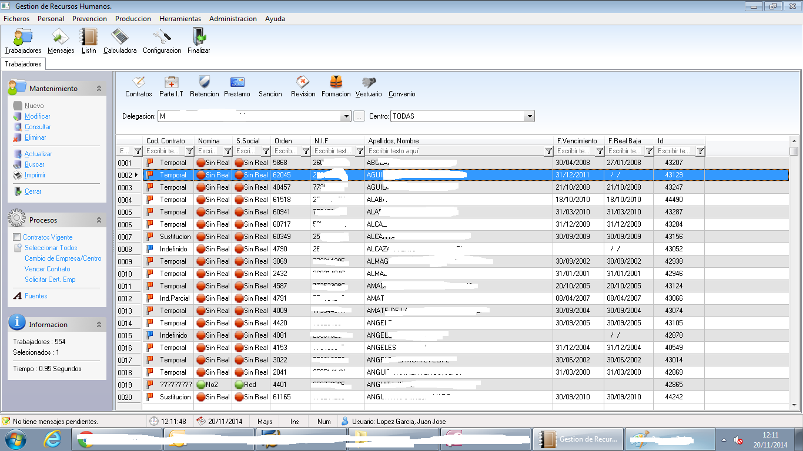
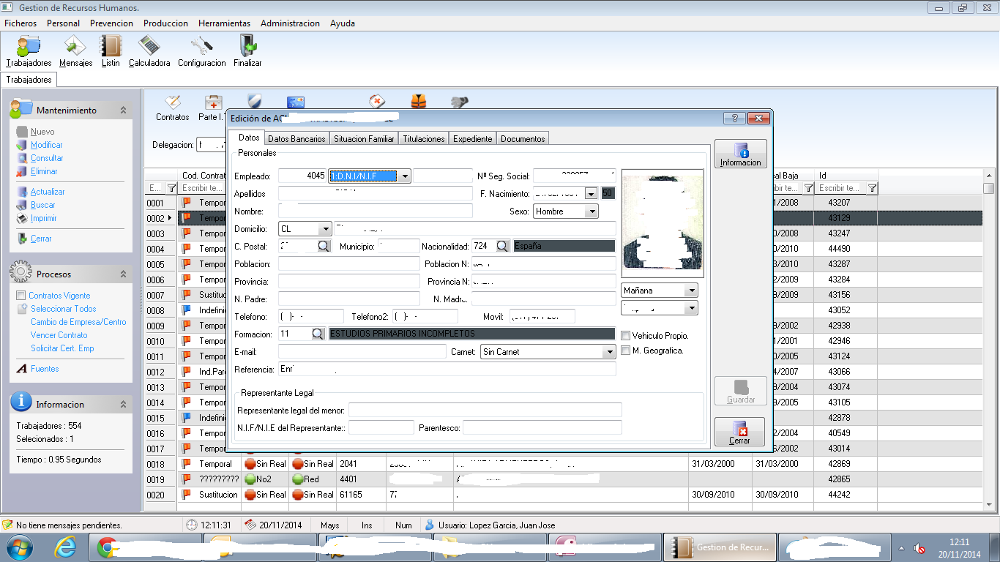
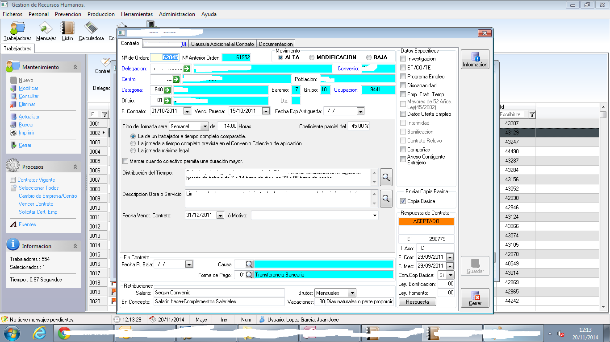
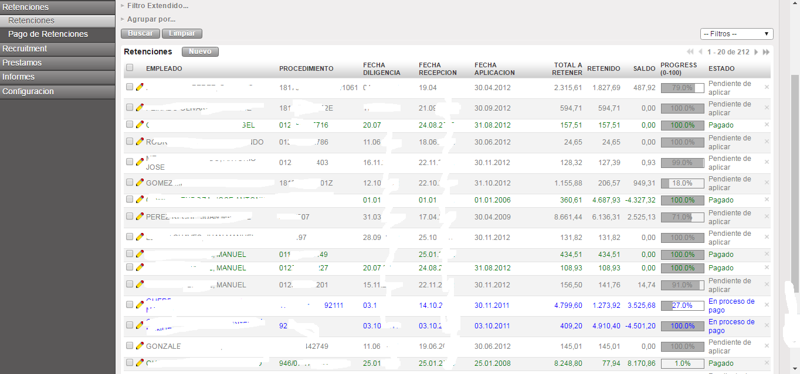
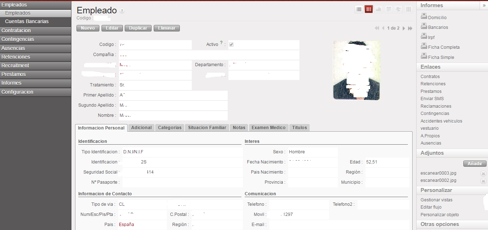
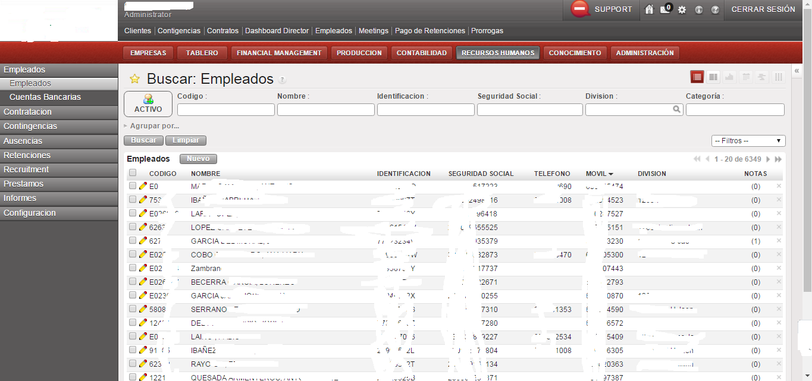
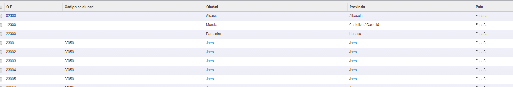
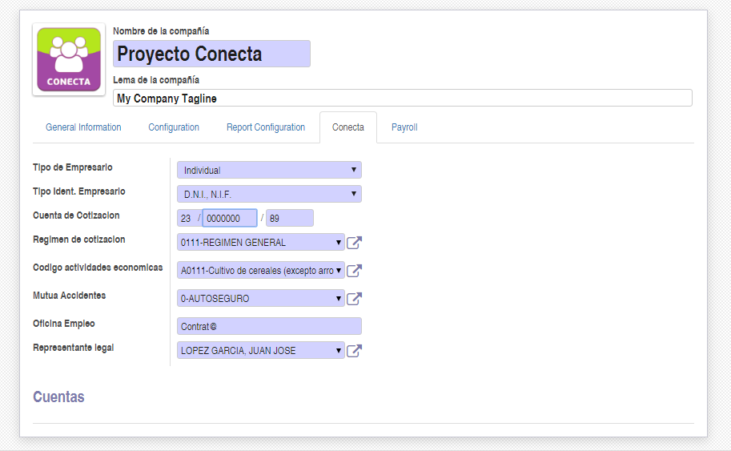
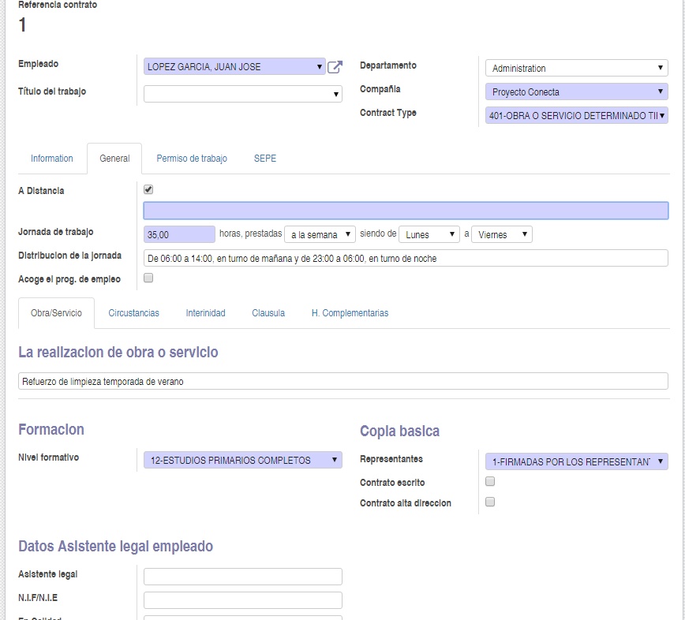
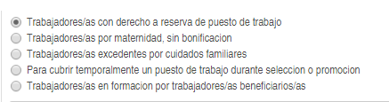
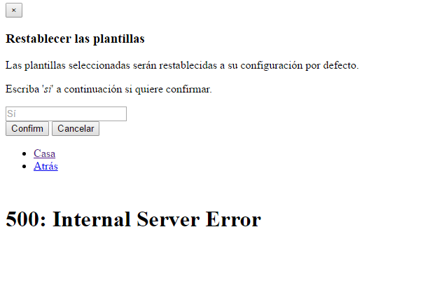
